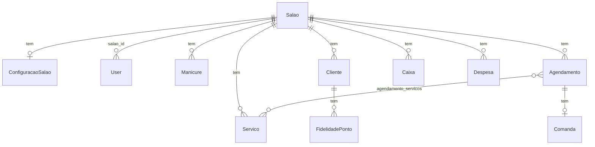

# Arquitetura — ManicurePro

**Data:** 2026-08-15  
**Estado atual:** Laravel 12 **single-tenant** (um salão por instalação), com foundation multi-empresa (`companies` + `saloes.company_id` nullable) ainda não usada no runtime.  
**Este documento descreve o presente e o caminho futuro multi-empresa.**

---

## Hoje: single-tenant

- Uma instalação = um negócio (Fernanda Silva Nails).
- O “salão canônico” é `Salao::principal()` / `Salao::principalId()` (`app/Models/Salao.php`).
- Admin **não cria nem exclui** salão (`routes/web.php`: resource `saloes` só `index|show|edit|update`).
- Home pública (`/`) é a página desse salão — não um marketplace multi-salão.
- Isolamento operacional: `users.salao_id` + middleware `check.salao` (`CheckSalao`) + checagens/`Policies` por `salao_id`.
- Já existe coluna `salao_id` na maior parte das tabelas de domínio (legado de um desenho que suportava N salões na mesma DB, usado hoje como tenant único).

### Camadas

```
routes/web.php + routes/api.php
        ↓
Http/Controllers/{Admin,Dono,Manicure,Cliente,Api,Auth,Public}
        ↓
Services/ (Agenda, Comanda, Estoque, Financeiro, Caixa, ClienteSegmentacao/CRM, MP, …)
        ↓
Eloquent Models + Policies
        ↓
MySQL / SQLite (testes)
```

Views: Blade + Bootstrap 5.3 + Vite. Auth web: sessão; API: Sanctum Bearer.

### Convenções relevantes

| Peça | Onde |
|------|------|
| Roles | enum em `users.role`: admin, dono, atendente, manicure, cliente |
| Feature flags | `config/manicure.php` |
| Jobs/notificações | fila (`QUEUE_CONNECTION`); WhatsApp/e-mail opt-in |
| Auditoria | `audit_logs` via `AuditLogger` |
| Produção | `docs/PRODUCAO.md` + `manicure:verificar-producao` |

---

## Modelo de dados atual (simplificado)



`Salao` é o agregado raiz de negócio. Não há entidade `Company` / `Empresa` / `Branch`.

---

## Futuro (estratégia): multi-empresa — SEM migrar agora

Objetivo típico: várias empresas (CNPJ/holding), cada uma com uma ou mais unidades (filiais), compartilhar código mas isolar dados.

### Vocabulário proposto

| Conceito | Coluna sugerida | Papel |
|----------|-----------------|-------|
| Empresa / conta | `company_id` | Tenant comercial (billing, donos, plano) |
| Unidade / filial | `branch_id` **ou** reutilizar `salao_id` | Local físico / agenda / estoque |

Duas opções honestas:

1. **`company_id` + manter `salao_id` como filial** — menos churn; `saloes` ganha `company_id`.
2. **`company_id` + `branch_id`** renomeando mentalmente o salão — só vale se quiser desacoplar a palavra “salão” do schema.

Recomendação de menor atrito: **opção 1**.

### O que já tem `salao_id` (vira “filial” sob uma company)

Quase todo o domínio operacional. Em uma migração futura, essas tabelas receberiam **`company_id` denormalizado** (para queries/tenant scope rápidos) **ou** resolveriam company via join em `saloes` — denormalizar é mais seguro sob carga.

Tabelas / models com `salao_id` hoje (não-exaustivo, via migrations):

- `users`, `configuracoes_salao`, `manicures`, `categorias_servico`, `servicos`
- `agendamentos`, `clientes`, `folgas`
- `produtos`, `estoque_movimentacoes`, `comandas`, `pagamentos`
- `avaliacoes`, `fidelidade_pontos`, `cupons`
- CRM: segmentação em `ClienteSegmentacao` (config `manicure.crm.*`); sem tabela própria — usa visitas/gasto + agendamentos
- `listas_espera`, `galeria_fotos`, `vales_presente`
- `pacotes`, `comissao_pagamentos`, `notas_fiscais`
- `caixas`, `despesas`

### O que **não** tem `salao_id` e precisaria de estratégia

| Tabela | Situação | Futuro multi-empresa |
|--------|----------|----------------------|
| `saloes` | raiz atual | ganhar `company_id` |
| `agendamento_servicos` | pivô via agendamento | herda via `agendamento_id` (opcional denorm) |
| `comanda_itens` | pivô via comanda | idem |
| `disponibilidades_manicure` | via manicure | idem / denorm `salao_id`+`company_id` |
| `folgas_manicure` | via manicure | idem |
| `slot_holds` | via manicure/agendamento | escopo por salão/company no service |
| `notificacoes` (legado) / `notifications` | user | escopo pelo user |
| `push_subscriptions` | `user_id` | escopo pelo user → company |
| `audit_logs` | sem tenant explícito | **adicionar `company_id`** (e idealmente `salao_id`) |
| `sessions`, `cache`, `jobs`, tokens | infra | global ou prefixo de cache por company |
| `cliente_ficha_historico` | via cliente | herda |
| `cliente_pacotes` | via cliente/pacote | herda |

### Tabelas novas (futuro)

```text
companies
  id, nome, documento, plano, ativo, ...

company_user  (opcional)
  company_id, user_id, role_na_empresa

saloes (alter)
  + company_id  -- filial da empresa
```

### O que mudaria no código (quando for a hora)

1. **Tenant resolution** — middleware que define `company_id` (e salão ativo) na request; abandonar `Salao::principal()` como default global.
2. **Global scopes** — `BelongsToCompany` / `BelongsToSalao` em models sensíveis.
3. **Admin SaaS** — role acima de dono (super-admin da plataforma) ≠ admin do salão atual.
4. **Billing / limites** — fora do escopo atual.
5. **Jobs e webhooks** — Mercado Pago/WhatsApp por company (credenciais não podem ser só `.env` global).
6. **Testes** — factories com 2 companies garantindo ausência de vazamento (IDOR cross-tenant).

### O que **não** fazer agora

- Foundation `companies` / `company_id` já existe — **não** ligar scopes/middleware até haver produto multi-empresa.
- Não quebrar `Salao::principal()` até haver resolução de tenant.
- Não fingir que o app já é SaaS: a home e o seeder são de um único salão.

---

## Diagrama de decisão (quando multi-empresa surgir)

```text
Precisa isolar dados de 2+ negócios na mesma instalação?
  não → manter single-tenant (hoje)
  sim → company_id em saloes + scopes
        Precisa de várias unidades por empresa?
          não → 1 salao por company
          sim → N saloes (filiais) por company_id
```

---

*Documento vivo. Implementação multi-empresa = projeto próprio, não “mais uma issue” da onda.*
